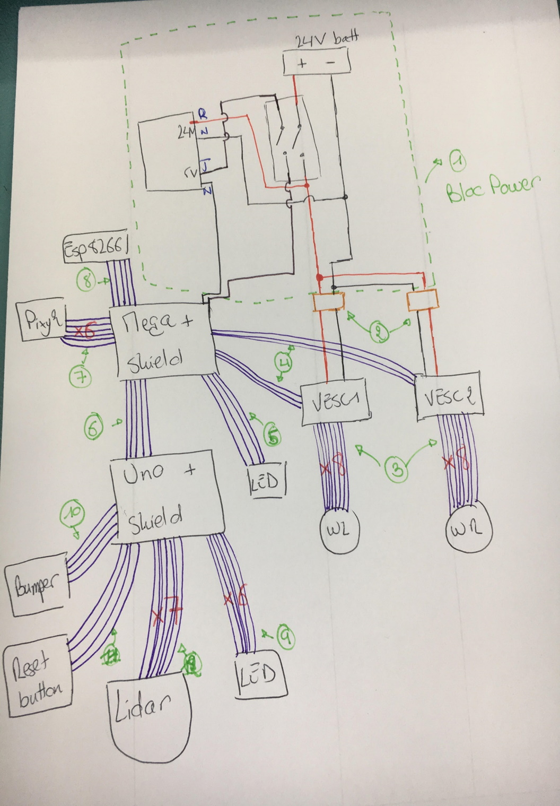

# Documentation

The vehicle is composed of 3 main componennts
1. the main Arduino Mega board (main/main.ino)   It is in charge of interfacing sub components and make the overall logic that make wheels spins
2. the obstacle detection Arduino Uno board.   It is in charge or detection obstacles using a (SlamTech A1M8 lidar)[https://www.slamtec.com/en/Lidar/A1] and collisions with simple mecanical switches (bumper)
3. an ESP8266  It is in charge of reporting various information over wifi as simple http GET requests towards a classic LAMP server. 

