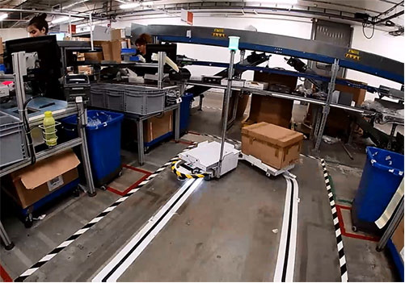

# Documentation

### overall context

### main components

1. **main Arduino Mega board** (main/main.ino)   It is in charge of interfacing sub components and make the overall logic that make wheels spins 
2. **rplidar Arduino Uno** (rplidar_arduino/rplidar_arduino/rplidar_arduino.ino).  It is in charge of detecting obstacles using a (SlamTech A1M8 lidar)[https://www.slamtec.com/en/Lidar/A1] (connected over Serial) and collisions on the front with simple mecanical switches (bumper).   This board is connected to main through a few pins (no Serial).
3. **ESP8266**  It is in charge of reporting various information over wifi as simple http GET requests towards a classic LAMP server.   the esp8266 is connected to main through Serial.

### others components
4. two (VESC 4.x)[https://vesc-project.com/Hardware] connected to main board, one serial link per VESC unit. Each VESC controls one wheel. VESC boards are configured using vesc_tool software
5. one (Pixy2)[https://docs.pixycam.com/wiki/doku.php?id=wiki:v2:start] connected to main board through ISP. That product is just configured using the bundled PixMon software.

### power
Power is delivered with two classic Lead Acid 7.5Ah batteries connected in serie (2x12 = 24v). A power converter is is used to deliver 5V to the main & rplidar arduino boards. 

### connection diagram

